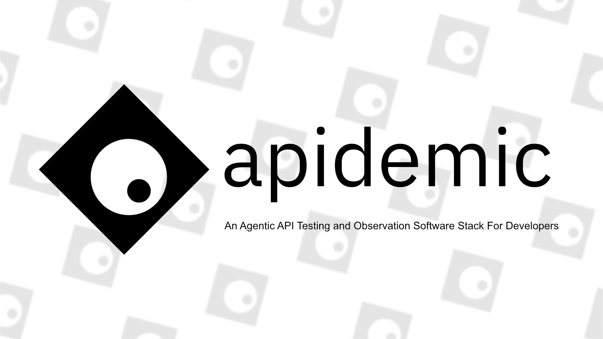

    Automated agentic <code>API testing</code> platform
     
     
    <a href="https://github.com/praveentek/apidemic/issues">Issues</a>
    ·
    <a href="https://github.com/praveen-tek/api-demic/blob/main/docs/Introduction.md">Docs</a>
    ·
    <a href="#">Changelog</a>

## About apidemic

apidemic is an automated agentic API testing platform. Instead of manually writing test cases or configuring static test suites, apidemic uses an agent-driven approach to explore, validate, and stress API endpoints intelligently — built for developers who want coverage without the overhead.

## Get Started

**Using apidemic in your project?**
→ Check out the [Quickstart Guide](#)

**Want to contribute?**
→ Read the [Contributors Guide](#)

## Features

- [ ] Agentic test execution — agent drives the testing flow without manual test case definition
- [ ] Automated endpoint coverage across REST APIs
- [ ] Edge case and failure mode detection
- [ ] Structured test reporting with actionable output
- [ ] CI/CD pipeline integration

## Status

`In active development. Core agentic testing loop in progress. Status[🟡]`

## License

This project is licensed under the **[MIT License](https://opensource.org/licenses/MIT)**.

By using this software, you agree to the terms of the license.